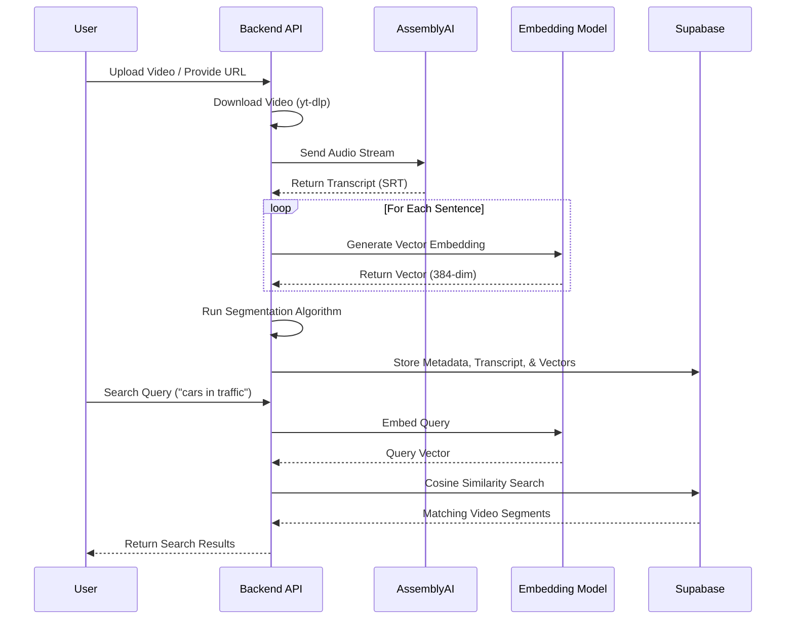

# NeuroClip: Project Presentation Content

## 1. Project Overview
**NeuroClip** is an intelligent video processing and semantic search application. It bridges the gap between raw video content and searchable knowledge by leveraging AI to transcribe, understand, and segment videos into meaningful semantic chunks.

**Core Value Proposition:**
- **Searchability:** Find specific moments in videos using natural language queries (e.g., "Show me where they talk about climate change").
- **Accessibility:** Automatically generates transcripts and metadata.
- **granular Understanding:** Breaks down long videos into distinct topics (segments) for easier consumption.

---

## 2. Architecture

The system follows a modern client-server architecture with heavy reliance on specialized AI services and vector databases.

```mermaid
graph TD
    User[User / Client] -->|HTTPS| Frontend[Frontend (React + Vite)]
    Frontend -->|API Requests| Backend[Backend (FastAPI)]
    
    subgraph "Backend Services"
        Backend -->|Video Download| YTDLP[yt-dlp]
        Backend -->|Transcription| AAI[AssemblyAI API]
        Backend -->|Embedding| Torch[PyTorch / SentenceTransformers]
        Backend -->|Segmentation| NumPy[NumPy Algorithms]
    end
    
    subgraph "Data Layer"
        Backend <-->|Store/Query Data| Supabase[Supabase (PostgreSQL)]
        Supabase -->|Vector Search| PGVector[pgvector Extension]
    end
```

### Key Components:
- **Frontend:** A responsive Single Page Application (SPA) built with React and Vite. It handles file uploads, displays video results, and visualizes search matches.
- **Backend:** A robust Python API (FastAPI) that orchestrates the heavy lifting: downloading videos, managing AI pipelines, and serving search results.
- **AI Engine:**
    - **AssemblyAI:** For high-accuracy Speech-to-Text (STT).
    - **SentenceTransformers (HuggingFace):** For converting text into high-dimensional vectors (embeddings) to enable semantic understanding.
- **Database:** Supabase (PostgreSQL) is used as the primary datastore. Crucially, it uses the `pgvector` extension to store and index embeddings, allowing for efficient "nearest neighbor" searches.

---

## 3. Technology Stack

### Frontend
- **Framework:** React 18 (via Vite)
- **Language:** TypeScript
- **Styling:** Tailwind CSS, Radix UI (Headless accessible components)
- **State Management:** TanStack Query (React Query)
- **Routing:** React Router DOM
- **Video:** React Player
- **Form Handling:** React Hook Form + Zod

### Backend
- **Framework:** FastAPI
- **Language:** Python 3.11+
- **AI/ML Libraries:** 
    - `torch` (PyTorch)
    - `sentence-transformers` (Text Embeddings)
    - `open_clip_torch` (Multimodal Embeddings - ready for future use)
    - `assemblyai` (Transcription SDK)
- **Data Processing:** `numpy`, `pandas` (implied/compatible), `scikit-learn`
- **Utilities:** `yt-dlp` (Video Extraction), `ffmpeg` (Media conversion)

### Infrastructure & Database
- **Database:** Supabase (PostgreSQL)
- **Vector Search:** `pgvector`
- **Storage:** Supabase Storage / Local File System (for temp files)

---

## 4. Workflow

The core processing pipeline transforms a raw video into searchable insights.



---

## 5. Deep Dive: How Summarization (Segmentation) Works

The current summarization logic relies on **Semantic Segmentation**. Instead of simply summarizing the whole text, the system identifies distinct topics within the video to create "chapters."

### The Algorithm (Text-Based):
1.  **Vectorization:** Every sentence in the transcript is converted into a mathematical vector using `sentence-transformers/all-MiniLM-L6-v2`. This vector represents the *meaning* of the sentence.
2.  **Coherence Calculation:** We calculate the **Cosine Similarity** between specific sentence $S_i$ and the next sentence $S_{i+1}$.
    - High Similarity ($ \approx 1.0 $): The topic is continuing.
    - Low Similarity ($ \approx 0.0 $): The topic has likely changed.
3.  **Signal Smoothing:** The sequence of similarity scores is "noisy." We apply a smoothing window (e.g., boxcar average) to see the broader trend.
4.  **Valley Detection:** The algorithm looks for "valleys" (local minima) in the coherence signal. A deep valley indicates a significant break in semantic flow—a fast topic switch.
5.  **Segmentation:** The video is sliced at these split points. The text within each slice is grouped to form a "Segment."

**Why this works:** People naturally pause or change their vocabulary when switching topics. The embedding model captures the shift in vocabulary context, and the algorithm detects the "break."

---

## 6. Future Improvement: Multimodal Summarization (Processing Frames)

Currently, the system is "blind"—it only reads the text. To reach standard-setting performance ("NeuroClip 2.0"), we can integrate **Computer Vision**.

### The Concept
A video is audio *plus* visual. Often, a scene change (visual cut) happens exactly when a topic changes, even if the speaker takes a few seconds to shift topics. Conversely, a visual change might indicate a new context that the text doesn't capture (e.g., a chart appearing on screen).

### Proposed Pipeline Update:
1.  **Frame Extraction:**
    - Use `ffmpeg` to extract one video frame every $N$ seconds (e.g., every 2 seconds).
2.  **Visual Embedding:**
    - Use a **VLM (Vision-Language Model)** like OpenAI's **CLIP** or **OpenClip** (which is already in your requirements!).
    - Pass each frame through the Image Encoder to get a vector: $V_{frame}$.
3.  **Fused Signal:**
    - Instead of relying only on Text Similarity ($Sim_{text}$), we calculate Visual Similarity ($Sim_{visual}$) between consecutive frames.
    - **Weighted Fusion:** $Score = \alpha \cdot Sim_{text} + (1-\alpha) \cdot Sim_{visual}$
4.  **Scene Boundary Detection:**
    - If the *Visual Similarity* drops drastically (a hard cut), it reinforces the probability of a segment break.
    - This leads to much deeper, more accurate segmentation (e.g., detecting slides changing in a lecture).

### Benefits of Image Processing:
- **Visual Search:** Users can search for "red car" and find it even if the speaker never says "red car", because the *frame embedding* matches the query.
- **Robustness:** If the audio is unclear or the transcript is poor, the visual cues can still provide accurate segmentation.
- **Rich Summaries:** Thumbnails for each segment can be automatically selected based on the most "representative" frame (the one most chemically similar to the segment's topic query).
