# Chapter 4 — System Modeling and Design Diagrams (NeuroClip)

> The figures embedded below are the **academic, thesis-style** versions (UML in black-and-white, DFDs in the orange Yourdon/Gane-Sarson palette). They live as PNG + SVG in [`./diagrams_academic/`](./diagrams_academic/).
> To regenerate after edits: `python docs/diagrams_academic/render_academic_diagrams.py` (only requires `matplotlib`, already in the project venv).
> The original Mermaid source files are preserved in [`./diagrams/`](./diagrams/) for future edits — to re-render the Mermaid versions: `cd docs/diagrams && npm install && npm run render`.
> Caption style for thesis use: **Arial Narrow, size 10**, placed *below* each figure (already baked into the rendered images).
> Update note: **Compression** *and* the **Auto-Anonymizer Blurring module** (YOLO-World + BoT-SORT + Caffe Res10 SSD + OpenFace nn4.small2) are modeled as **separate modules** across the use case, activity, DFD, sequence, class, component, and deployment diagrams.

---

## 4.2 Use Case Diagram

The use case diagram defines the **system boundary** of NeuroClip and shows every functionality that an actor can invoke. The primary actor is the **End User**, who interacts with the React frontend; the **Backend Service (FastAPI)**, **Supabase**, and **AssemblyAI** act as supporting actors that fulfil the user goals. An **Admin** actor is included as an optional secondary actor.

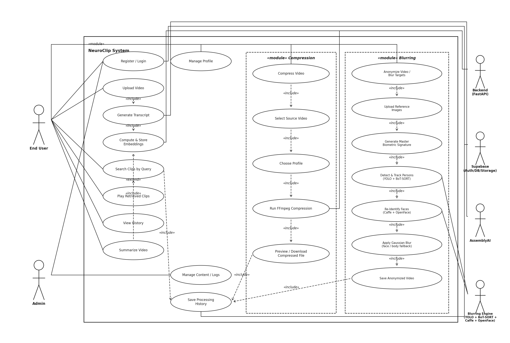

**Figure 4.2:** NeuroClip Use Case Diagram *(caption: Arial Narrow, size 10)*

Mermaid source

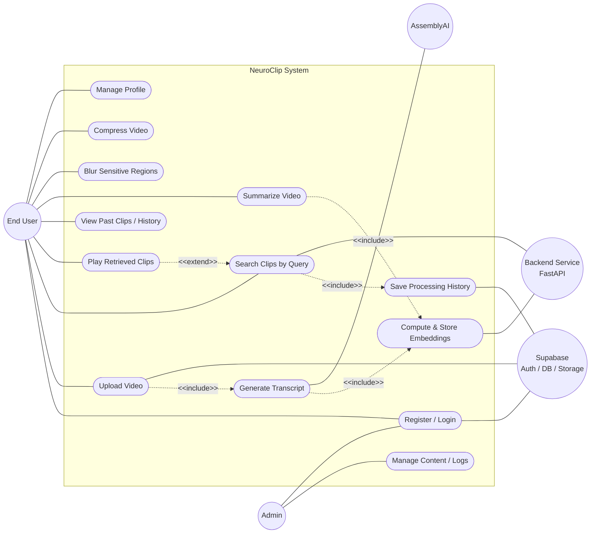
```mermaid
flowchart LR
    User(("End User"))
    Admin(("Admin"))
    Backend(("Backend Service<br/>FastAPI"))
    Supabase(("Supabase<br/>Auth / DB / Storage"))
    AAI(("AssemblyAI"))

    subgraph NeuroClip["NeuroClip System"]
        direction TB
        UC1(["Register / Login"])
        UC2(["Upload Video"])
        UC3(["Generate Transcript"])
        UC4(["Compute &amp; Store Embeddings"])
        UC5(["Search Clips by Query"])
        UC6(["Play Retrieved Clips"])
        UC7(["View Past Clips / History"])
        UC8(["Summarize Video"])
        UC9(["Blur Sensitive Regions"])
        UC10(["Compress Video"])
        UC11(["Manage Profile"])
        UC12(["Save Processing History"])
        UC13(["Manage Content / Logs"])
    end

    User --- UC1
    User --- UC2
    User --- UC5
    User --- UC6
    User --- UC7
    User --- UC8
    User --- UC9
    User --- UC10
    User --- UC11

    Admin --- UC13
    Admin --- UC1

    UC2 -. "&lt;&lt;include&gt;&gt;" .-> UC3
    UC3 -. "&lt;&lt;include&gt;&gt;" .-> UC4
    UC5 -. "&lt;&lt;include&gt;&gt;" .-> UC12
    UC8 -. "&lt;&lt;include&gt;&gt;" .-> UC4
    UC6 -. "&lt;&lt;extend&gt;&gt;"  .-> UC5

    UC3 --- AAI
    UC4 --- Backend
    UC5 --- Backend
    UC1 --- Supabase
    UC12 --- Supabase
    UC2 --- Supabase
```

---

## 4.3 Full-Dress Use Case

### 4.3.1 Search & Assemble Clips — Full-Dress Use Case

> *(The thesis template originally referenced the generic "Arm/disarm systems" full-dress use case. For NeuroClip the equivalent core scenario is **Searching and Assembling Clips by Semantic Query** — the central interaction the entire pipeline is built around.)*

| Field | Description |
|---|---|
| **Use Case ID** | UC-4.3.1 |
| **Use Case Name** | Search & Assemble Clips by Semantic Query |
| **Primary Actor** | End User |
| **Supporting Actors** | Frontend (React), Backend (FastAPI), Supabase (pgvector + Storage), AssemblyAI |
| **Stakeholders & Interests** | • End User – wants relevant, playable video segments for a natural-language query. • Admin – wants accurate analytics and history records. • System Owner – wants low-latency, cost-controlled search. |
| **Preconditions** | 1. User has a verified account and an active session. 2. At least one video has been uploaded, transcribed, and embedded for the user. 3. Vector index (`pgvector`) is online and reachable. 4. Supabase Storage bucket holding the source video is accessible. |
| **Postconditions (Success Guarantee)** | 1. A ranked list of clip URLs is returned to the user and rendered in the player. 2. The query, parameters, results, and `job_id` are persisted to `processing_history`. 3. Generated/merged clip artefacts are cached in Storage for replay. |
| **Trigger** | User submits a query string (and optional filters) on the `/video/:id` page and clicks **Search**. |
| **Main Success Scenario** | 1. User opens the Video page for a previously uploaded video. 2. User types a query (e.g. *"the moment Trump declares victory"*) and submits. 3. Frontend `POST`s to `/clips/search-db` with `{ job_id, query, top_k, params }`. 4. Backend `SearchService` encodes the query into an embedding vector. 5. Backend retrieves the top-k matching `EmbeddingRow`s from `pgvector`. 6. Backend reranks results, merges temporally adjacent neighbours, and computes clip boundaries `(start, end)`. 7. Backend asks `StorageService` to slice / mux clips and produce signed URLs. 8. Backend records the request and outcome in `processing_history` keyed by `job_id`. 9. Backend returns a JSON payload of `ClipResult[]` to the Frontend. 10. Frontend renders the clips in the player and updates the history sidebar. |
| **Extensions / Alternative Flows** | **A1. Empty result set (step 6):** System suggests broadening the query or relaxing filters; no history record beyond the empty query is saved. **A2. Vector store unreachable (step 5):** System falls back to keyword search over `TranscriptSegment`; result is flagged "fallback". **A3. Storage signing fails (step 7):** System returns segment metadata only; UI shows "preview unavailable" and offers retry. **A4. Auth expired (step 3):** API returns 401 → frontend redirects to `/auth` and queues the query for replay after login. |
| **Special Requirements** | • End-to-end latency ≤ 4 s for `top_k ≤ 20`. • Clip URLs must expire in ≤ 1 h (signed URL TTL). • All requests over HTTPS; RLS enforced on every table touched. |
| **Frequency of Occurrence** | Highest-frequency operation in the system (every active session). |
| **Open Issues** | Optional intent classification (`P4.1`) is currently disabled by default; needs A/B evaluation before enabling. |

---

## 4.4 Activity Diagram

Models the end-to-end user journey from registration through clip retrieval, including the key decision points (verification, transcript availability, search hit/miss).

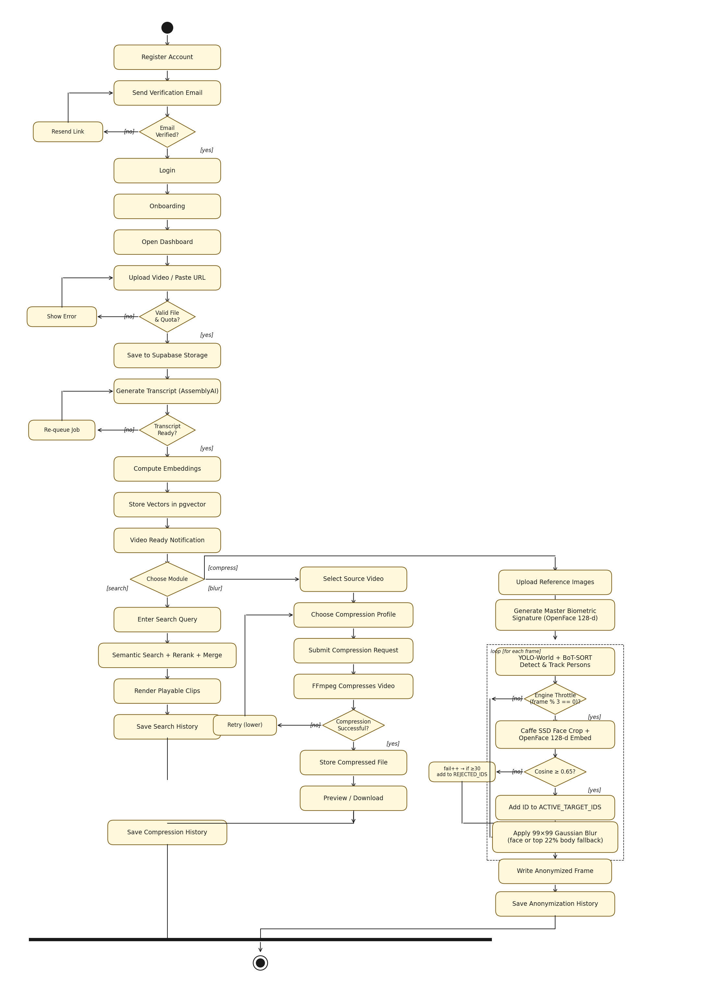

**Figure 4.4:** NeuroClip Activity Diagram *(caption: Arial Narrow, size 10)*

Mermaid source

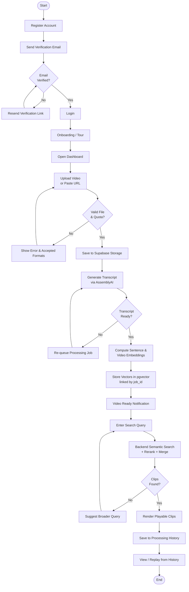
```mermaid
flowchart TD
    Start([Start]) --> Reg[Register Account]
    Reg --> SendMail[Send Verification Email]
    SendMail --> Verified{Email<br/>Verified?}
    Verified -- No --> Resend[Resend Verification Link]
    Resend --> Verified
    Verified -- Yes --> Login[Login]
    Login --> Onboard[Onboarding / Tour]
    Onboard --> Dashboard[Open Dashboard]

    Dashboard --> Upload[Upload Video<br/>or Paste URL]
    Upload --> Validate{Valid File<br/>&amp; Quota?}
    Validate -- No --> ShowErr[Show Error &amp; Accepted Formats]
    ShowErr --> Upload
    Validate -- Yes --> Store[Save to Supabase Storage]

    Store --> Transcribe[Generate Transcript<br/>via AssemblyAI]
    Transcribe --> TrOk{Transcript<br/>Ready?}
    TrOk -- No --> Requeue[Re-queue Processing Job]
    Requeue --> Transcribe
    TrOk -- Yes --> Embed[Compute Sentence &amp;<br/>Video Embeddings]

    Embed --> StoreVec[Store Vectors in pgvector<br/>linked by job_id]
    StoreVec --> Ready[Video Ready Notification]

    Ready --> Query[Enter Search Query]
    Query --> Search[Backend Semantic Search<br/>+ Rerank + Merge]
    Search --> Hit{Clips<br/>Found?}
    Hit -- No --> Suggest[Suggest Broader Query]
    Suggest --> Query
    Hit -- Yes --> Render[Render Playable Clips]
    Render --> Save[Save to Processing History]
    Save --> History[View / Replay from History]
    History --> End([End])
```

---

## 4.5 Data Flow Diagrams

### 4.5.1 DFD Level 0 — Context Diagram

Shows NeuroClip as a single process with its external entities and primary data exchanges.

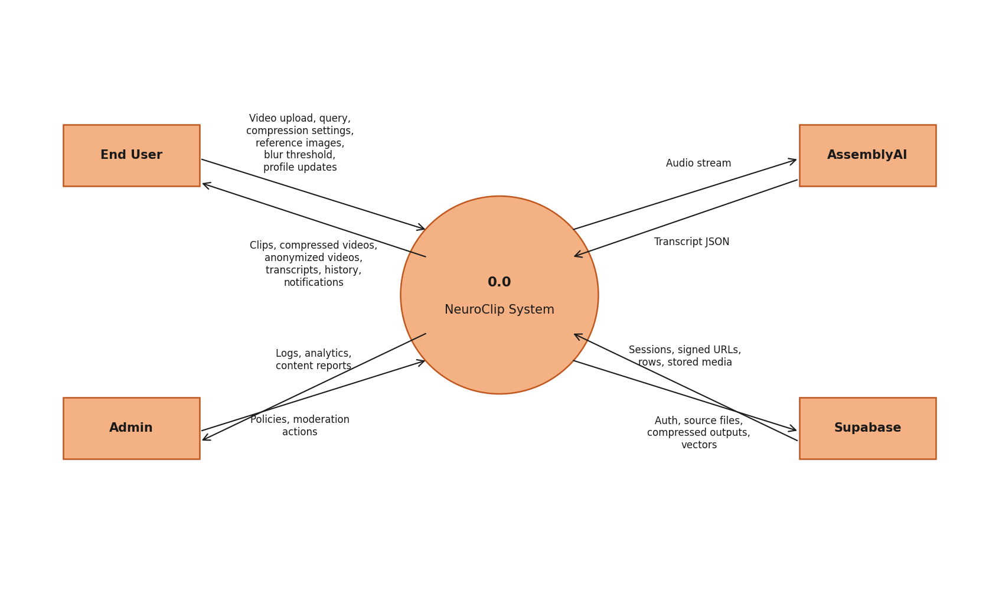

**Figure 4.5.1:** DFD Level 0 — Context Diagram *(caption: Arial Narrow, size 10)*

Mermaid source

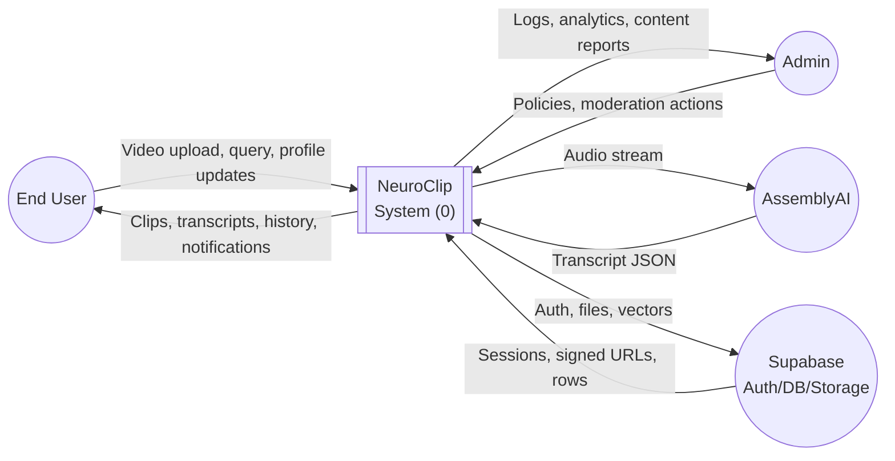
```mermaid
flowchart LR
    User(("End User"))
    Admin(("Admin"))
    AAI(("AssemblyAI"))
    Sup(("Supabase<br/>Auth/DB/Storage"))

    NC[["NeuroClip<br/>System (0)"]]

    User -- "Video upload, query, profile updates" --> NC
    NC   -- "Clips, transcripts, history, notifications" --> User
    Admin -- "Policies, moderation actions" --> NC
    NC    -- "Logs, analytics, content reports" --> Admin
    NC  -- "Audio stream"   --> AAI
    AAI -- "Transcript JSON" --> NC
    NC  -- "Auth, files, vectors" --> Sup
    Sup -- "Sessions, signed URLs, rows" --> NC
```

---

### 4.5.2 DFD Level 1 — Major Processes

Decomposes NeuroClip into its five top-level processes and their data stores.

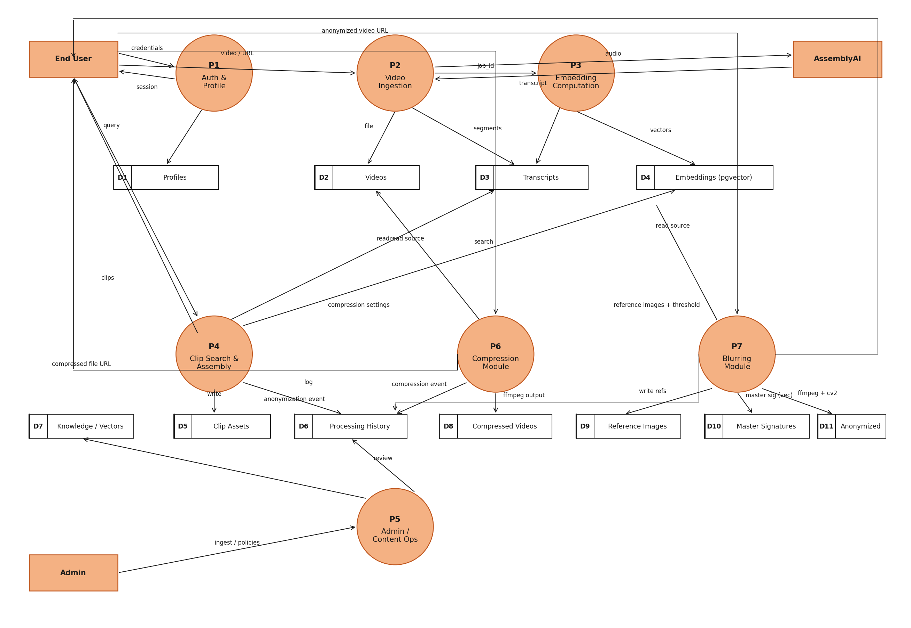

**Figure 4.5.2:** DFD Level 1 — Major Processes *(caption: Arial Narrow, size 10)*

Mermaid source

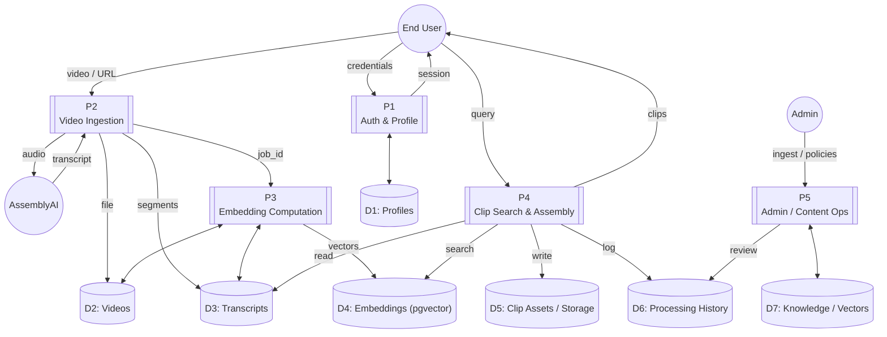
```mermaid
flowchart TB
    User(("End User"))
    Admin(("Admin"))
    AAI(("AssemblyAI"))
    P1[["P1<br/>Auth &amp; Profile"]]
    P2[["P2<br/>Video Ingestion"]]
    P3[["P3<br/>Embedding Computation"]]
    P4[["P4<br/>Clip Search &amp; Assembly"]]
    P5[["P5<br/>Admin / Content Ops"]]
    D1[("D1: Profiles")]
    D2[("D2: Videos")]
    D3[("D3: Transcripts")]
    D4[("D4: Embeddings (pgvector)")]
    D5[("D5: Clip Assets / Storage")]
    D6[("D6: Processing History")]
    D7[("D7: Knowledge / Vectors")]
    User -- credentials --> P1
    P1   -- session     --> User
    P1 <--> D1
    User -- video / URL --> P2
    P2 -- file --> D2
    P2 -- audio --> AAI
    AAI -- transcript --> P2
    P2 -- segments --> D3
    P2 -- "job_id" --> P3
    P3 <--> D2
    P3 <--> D3
    P3 -- vectors --> D4
    User -- query --> P4
    P4 -- search --> D4
    P4 -- read --> D3
    P4 -- write --> D5
    P4 -- log --> D6
    P4 -- clips --> User
    Admin -- ingest / policies --> P5
    P5 <--> D7
    P5 -- review --> D6
```

---

### 4.5.3 DFD Level 2 — Clip Search & Assembly (Explosion of P4)

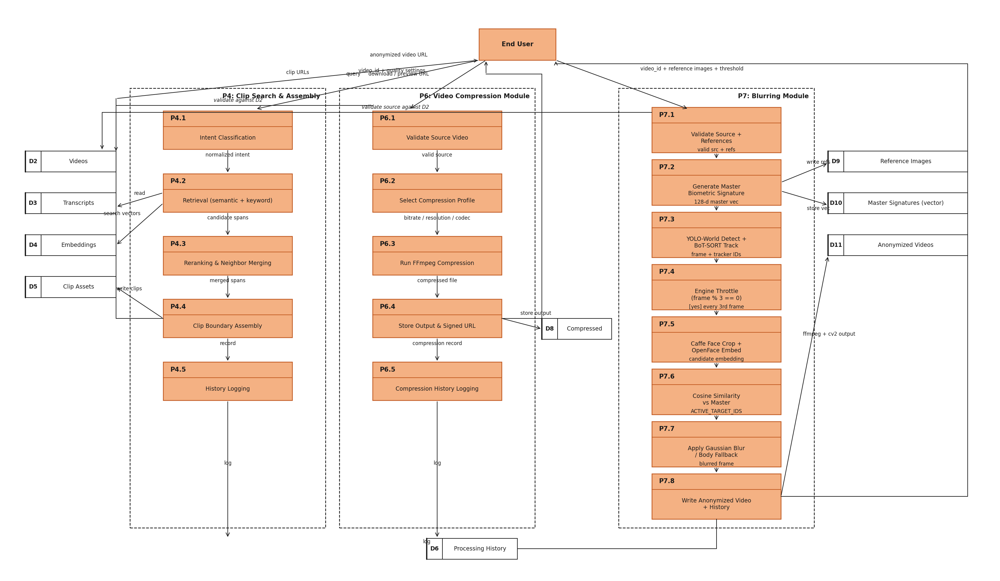

**Figure 4.5.3:** DFD Level 2 — Clip Search & Assembly *(caption: Arial Narrow, size 10)*

Mermaid source

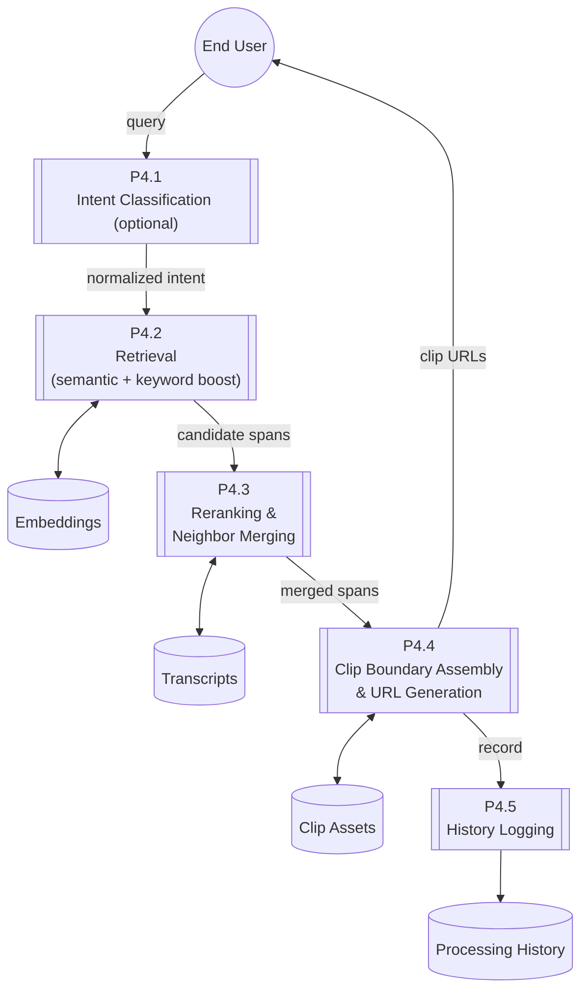
```mermaid
flowchart TB
    User(("End User"))
    D3[("Transcripts")]
    D4[("Embeddings")]
    D5[("Clip Assets")]
    D6[("Processing History")]
    P41[["P4.1<br/>Intent Classification (optional)"]]
    P42[["P4.2<br/>Retrieval<br/>(semantic + keyword boost)"]]
    P43[["P4.3<br/>Reranking &amp;<br/>Neighbor Merging"]]
    P44[["P4.4<br/>Clip Boundary Assembly<br/>&amp; URL Generation"]]
    P45[["P4.5<br/>History Logging"]]
    User -- query --> P41
    P41 -- normalized intent --> P42
    P42 <--> D4
    P42 -- candidate spans --> P43
    P43 <--> D3
    P43 -- merged spans --> P44
    P44 <--> D5
    P44 -- clip URLs --> User
    P44 -- record --> P45
    P45 --> D6
```

---

## 4.6 System Sequence Diagram

A black-box view of the **Clip Search** scenario showing the messages crossing the system boundary.

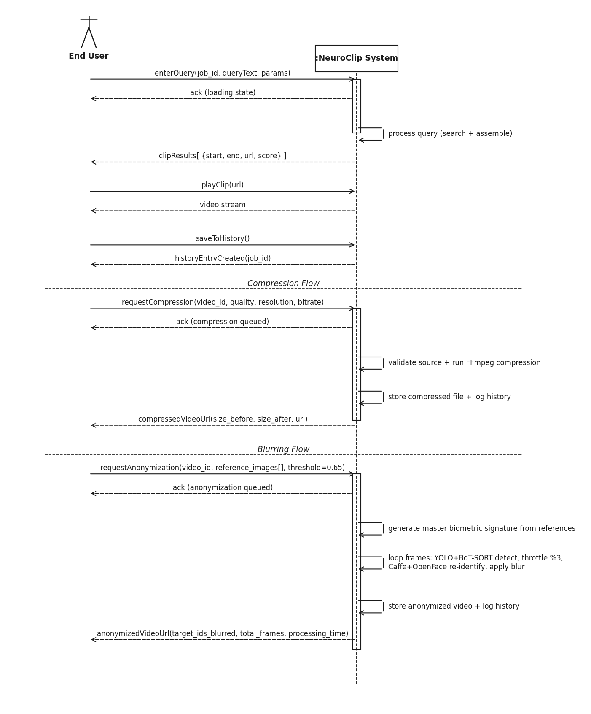

**Figure 4.6:** System Sequence Diagram — Clip Search Scenario *(caption: Arial Narrow, size 10)*

Mermaid source

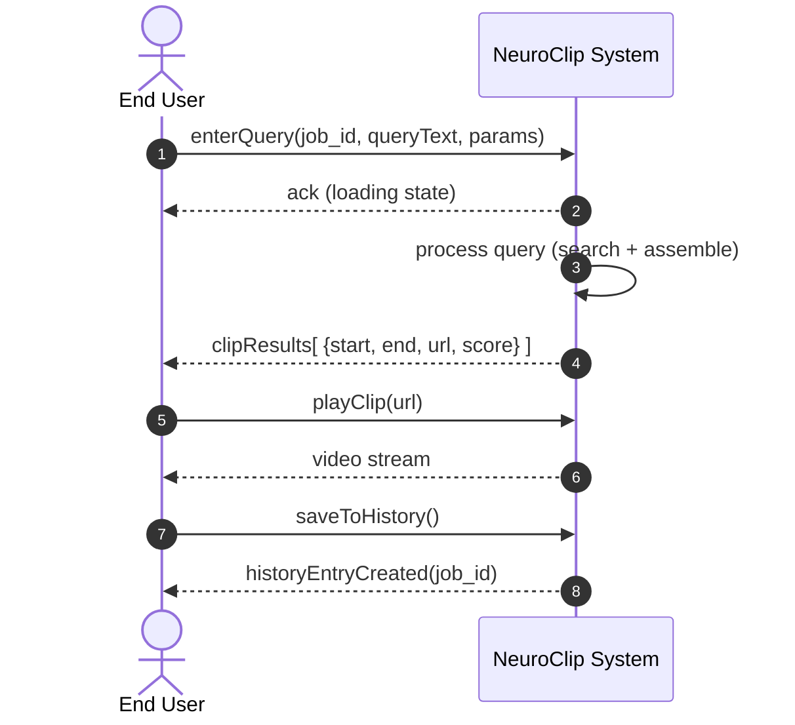
```mermaid
sequenceDiagram
    autonumber
    actor U as End User
    participant S as NeuroClip System
    U  ->> S : enterQuery(job_id, queryText, params)
    S  -->> U : ack (loading state)
    S  ->> S : process query (search + assemble)
    S  -->> U : clipResults[ {start, end, url, score} ]
    U  ->> S : playClip(url)
    S  -->> U : video stream
    U  ->> S : saveToHistory()
    S  -->> U : historyEntryCreated(job_id)
```

---

## 4.7 Sequence Diagram (White-Box / Detailed)

Two detailed object-level sequences covering both major flows.

### 4.7.1 Email Verification → First Login

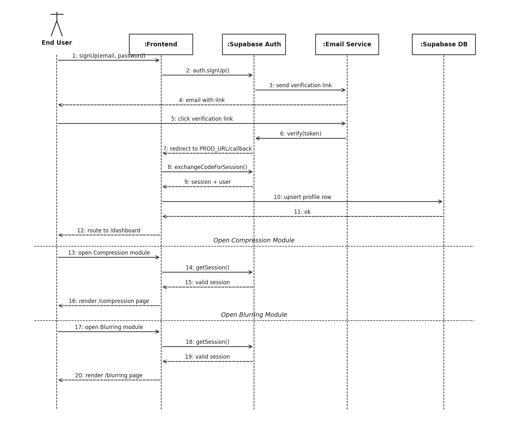

**Figure 4.7.1:** Email Verification & First Login Sequence *(caption: Arial Narrow, size 10)*

Mermaid source

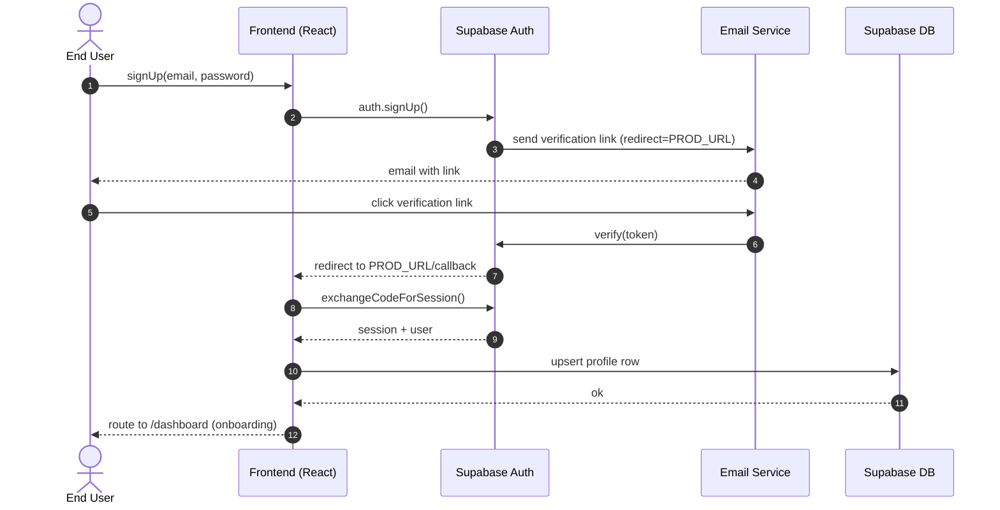
```mermaid
sequenceDiagram
    autonumber
    actor U as End User
    participant FE as Frontend (React)
    participant SUP as Supabase Auth
    participant MAIL as Email Service
    participant DB as Supabase DB
    U   ->> FE  : signUp(email, password)
    FE  ->> SUP : auth.signUp()
    SUP ->> MAIL: send verification link (redirect=PROD_URL)
    MAIL-->> U  : email with link
    U   ->> MAIL: click verification link
    MAIL->> SUP : verify(token)
    SUP -->> FE : redirect to PROD_URL/callback
    FE  ->> SUP : exchangeCodeForSession()
    SUP -->> FE : session + user
    FE  ->> DB  : upsert profile row
    DB  -->> FE : ok
    FE  -->> U  : route to /dashboard (onboarding)
```

### 4.7.2 Clip Search End-to-End

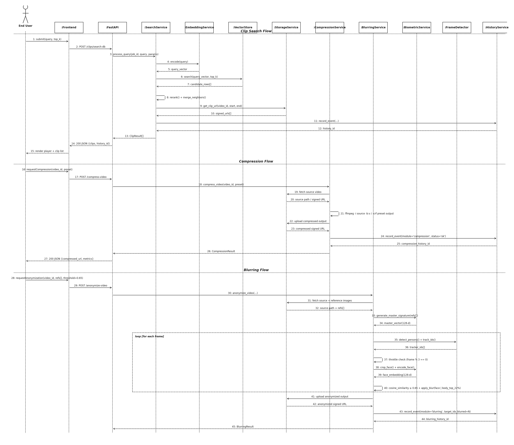

**Figure 4.7.2:** Clip Search End-to-End Sequence *(caption: Arial Narrow, size 10)*

Mermaid source

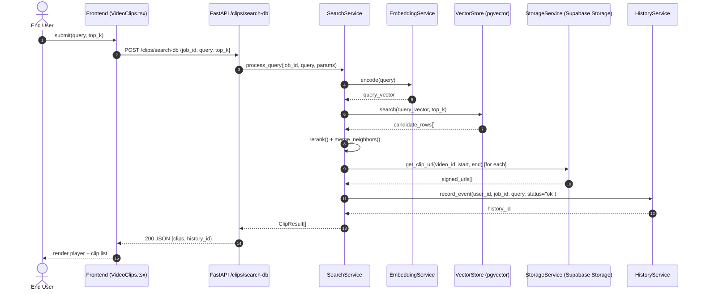
```mermaid
sequenceDiagram
    autonumber
    actor U as End User
    participant FE as Frontend (VideoClips.tsx)
    participant API as FastAPI /clips/search-db
    participant SS as SearchService
    participant ES as EmbeddingService
    participant VS as VectorStore (pgvector)
    participant ST as StorageService (Supabase Storage)
    participant HS as HistoryService
    U  ->> FE  : submit(query, top_k)
    FE ->> API : POST /clips/search-db {job_id, query, top_k}
    API ->> SS : process_query(job_id, query, params)
    SS  ->> ES : encode(query)
    ES  -->> SS: query_vector
    SS  ->> VS : search(query_vector, top_k)
    VS  -->> SS: candidate_rows[]
    SS  ->> SS : rerank() + merge_neighbors()
    SS  ->> ST : get_clip_url(video_id, start, end) [for each]
    ST  -->> SS: signed_urls[]
    SS  ->> HS : record_event(user_id, job_id, query, status="ok")
    HS  -->> SS: history_id
    SS  -->> API: ClipResult[]
    API -->> FE : 200 JSON {clips, history_id}
    FE  -->> U  : render player + clip list
```

---

## 4.8 Design Class Diagram

Domain entities, services, and their relationships.

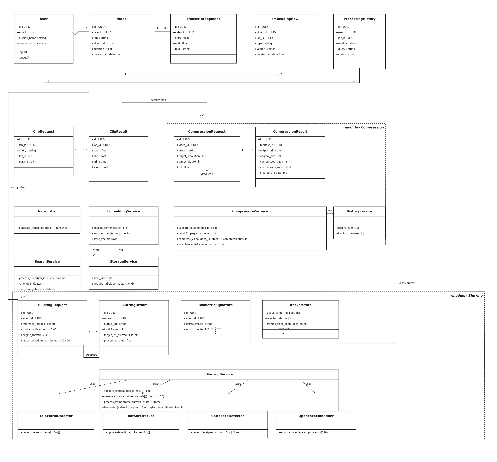

**Figure 4.8:** Design Class Diagram *(caption: Arial Narrow, size 10)*

Mermaid source

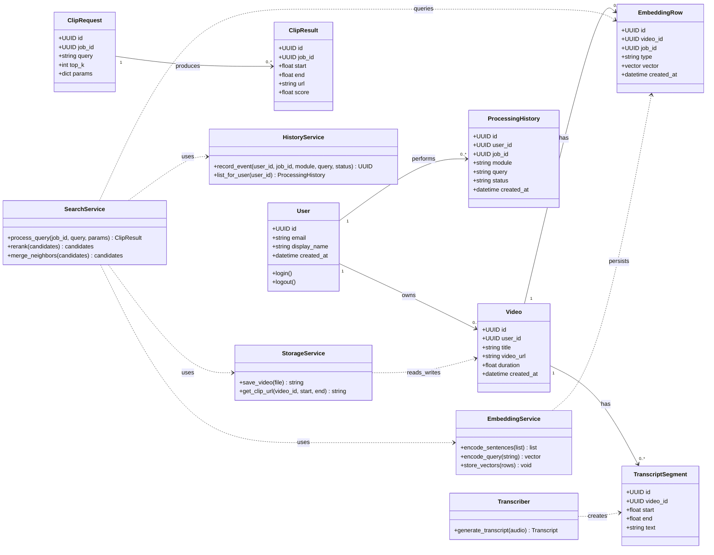
```mermaid
classDiagram
    direction LR
    class User {
        +UUID id
        +string email
        +string display_name
        +datetime created_at
        +login()
        +logout()
    }
    class Video {
        +UUID id
        +UUID user_id
        +string title
        +string video_url
        +float duration
        +datetime created_at
    }
    class TranscriptSegment {
        +UUID id
        +UUID video_id
        +float start
        +float end
        +string text
    }
    class EmbeddingRow {
        +UUID id
        +UUID video_id
        +UUID job_id
        +string type
        +vector vector
        +datetime created_at
    }
    class ProcessingHistory {
        +UUID id
        +UUID user_id
        +UUID job_id
        +string module
        +string query
        +string status
        +datetime created_at
    }
    class ClipRequest {
        +UUID id
        +UUID job_id
        +string query
        +int top_k
        +dict params
    }
    class ClipResult {
        +UUID id
        +UUID job_id
        +float start
        +float end
        +string url
        +float score
    }
    class Transcriber {
        +generate_transcript(audio) Transcript
    }
    class EmbeddingService {
        +encode_sentences(list) list
        +encode_query(string) vector
        +store_vectors(rows) void
    }
    class SearchService {
        +process_query(job_id, query, params) ClipResult
        +rerank(candidates) candidates
        +merge_neighbors(candidates) candidates
    }
    class HistoryService {
        +record_event(user_id, job_id, module, query, status) UUID
        +list_for_user(user_id) ProcessingHistory
    }
    class StorageService {
        +save_video(file) string
        +get_clip_url(video_id, start, end) string
    }
    User "1" --> "0..*" Video : owns
    Video "1" --> "0..*" TranscriptSegment : has
    Video "1" --> "0..*" EmbeddingRow : has
    User "1" --> "0..*" ProcessingHistory : performs
    ClipRequest "1" --> "0..*" ClipResult : produces
    SearchService ..> EmbeddingService : uses
    SearchService ..> StorageService   : uses
    SearchService ..> HistoryService   : uses
    SearchService ..> EmbeddingRow     : queries
    EmbeddingService ..> EmbeddingRow  : persists
    Transcriber ..> TranscriptSegment  : creates
    StorageService ..> Video           : reads_writes
```

---

## 4.9 Architectural Diagrams

### 4.9.1 Interface Design (Page / Navigation Map)

A UI map of every routable page in the React app and the shared layout/components that compose them.

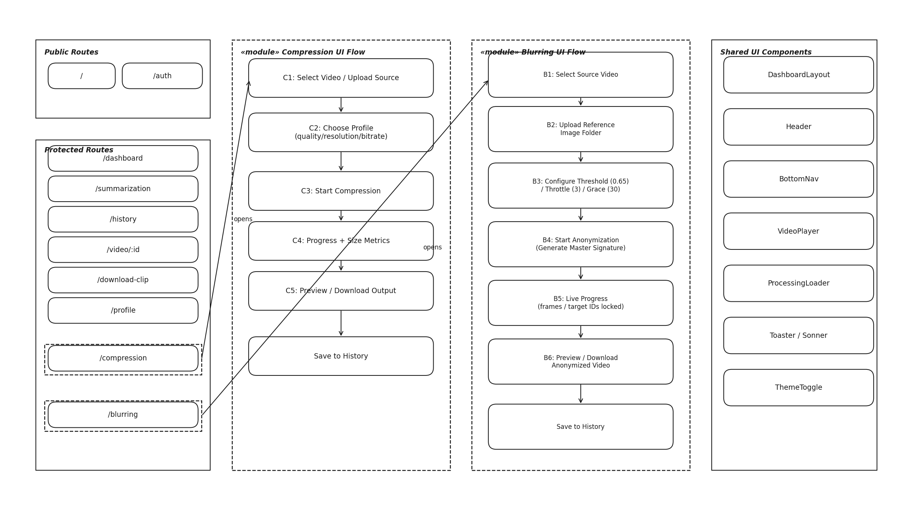

**Figure 4.9.1:** Interface Design — Page Map *(caption: Arial Narrow, size 10)*

Mermaid source

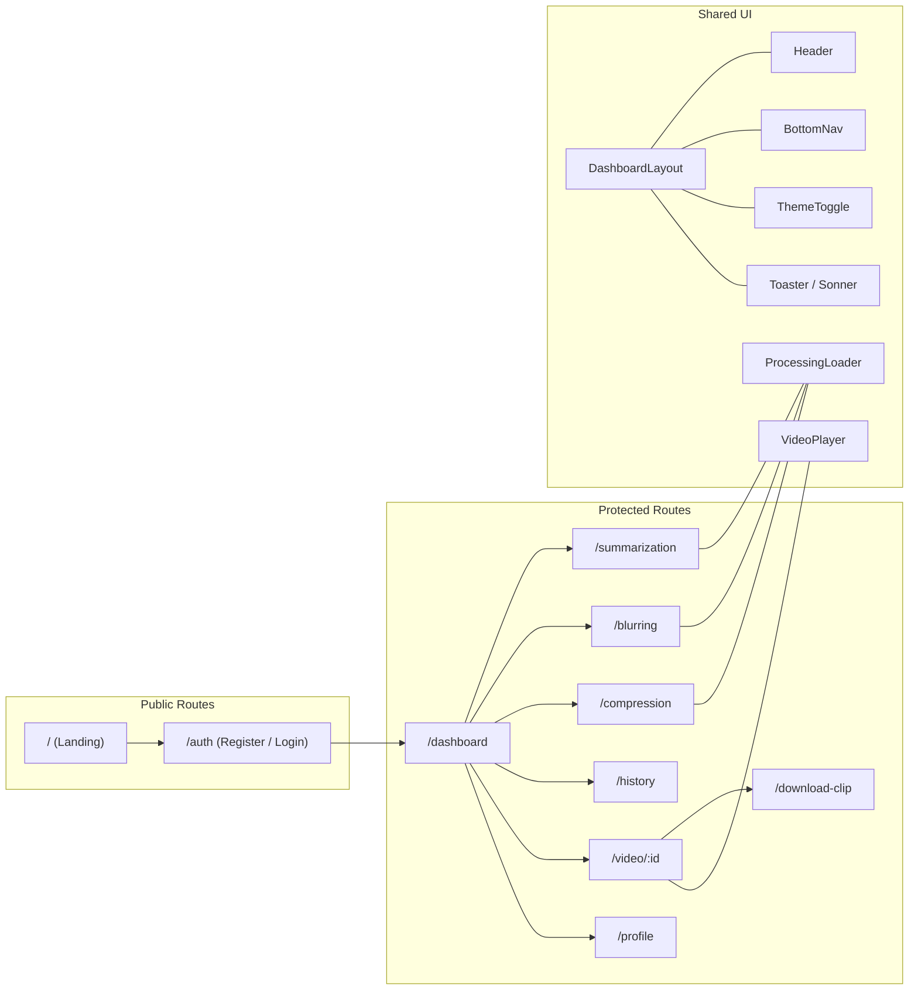
```mermaid
flowchart LR
    subgraph Public["Public Routes"]
        Index["/  (Landing)"]
        Auth["/auth (Register / Login)"]
    end
    subgraph Protected["Protected Routes"]
        Dashboard["/dashboard"]
        Summarization["/summarization"]
        Blurring["/blurring"]
        Compression["/compression"]
        History["/history"]
        VideoClips["/video/:id"]
        DownloadClip["/download-clip"]
        Profile["/profile"]
    end
    subgraph Shared["Shared UI"]
        Layout[DashboardLayout]
        Header[Header]
        BottomNav[BottomNav]
        Player[VideoPlayer]
        Loader[ProcessingLoader]
        Toast[Toaster / Sonner]
        Theme[ThemeToggle]
    end
    Index --> Auth
    Auth  --> Dashboard
    Dashboard --> Summarization
    Dashboard --> Blurring
    Dashboard --> Compression
    Dashboard --> History
    Dashboard --> VideoClips
    VideoClips --> DownloadClip
    Dashboard --> Profile
    Layout --- Header
    Layout --- BottomNav
    Layout --- Theme
    VideoClips --- Player
    Summarization --- Loader
    Blurring --- Loader
    Compression --- Loader
    Layout --- Toast
```

---

### 4.9.2 Component Level Design

Logical component view spanning the React frontend, the FastAPI backend services, and the AI/ML pipeline.

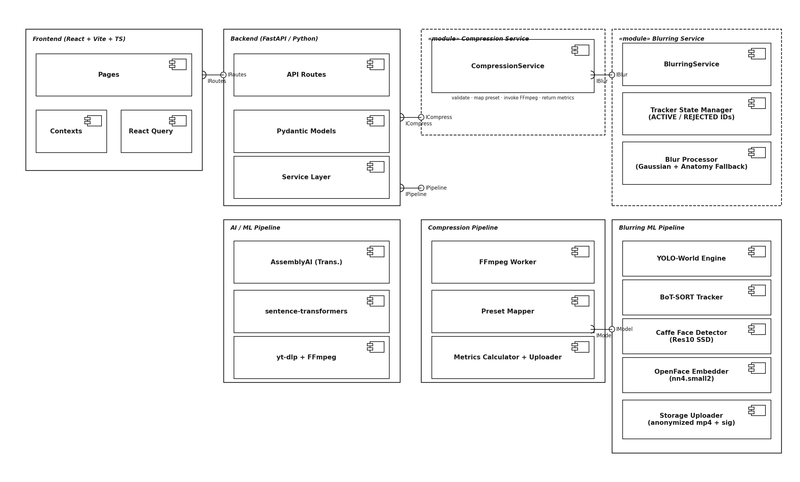

**Figure 4.9.2:** Component Level Design *(caption: Arial Narrow, size 10)*

Mermaid source

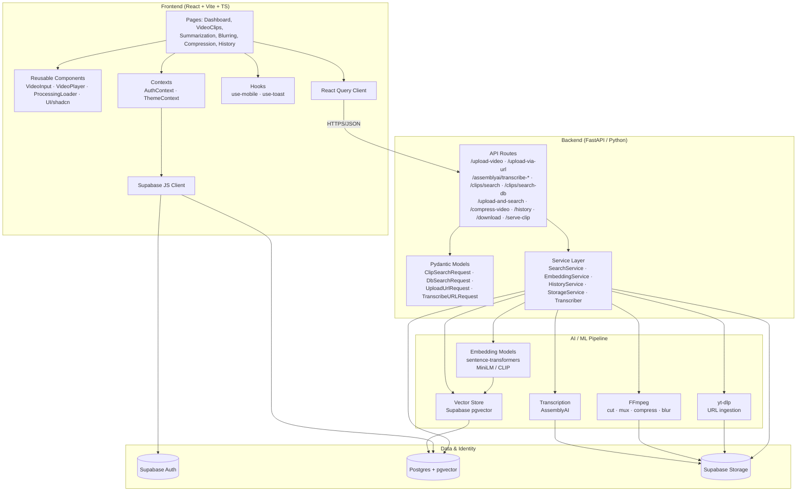
```mermaid
flowchart TB
    subgraph FE["Frontend (React + Vite + TS)"]
        direction TB
        Pages[Pages: Dashboard, VideoClips,<br/>Summarization, Blurring, Compression, History]
        Comp[Reusable Components<br/>VideoInput · VideoPlayer · ProcessingLoader · UI/shadcn]
        Ctx[Contexts<br/>AuthContext · ThemeContext]
        Hooks[Hooks<br/>use-mobile · use-toast]
        Client[Supabase JS Client]
        QueryC[React Query Client]
    end
    subgraph BE["Backend (FastAPI / Python)"]
        direction TB
        Routes["API Routes<br/>/upload-video · /upload-via-url<br/>/assemblyai/transcribe-* · /clips/search · /clips/search-db<br/>/upload-and-search · /compress-video · /history · /download · /serve-clip"]
        Models[Pydantic Models<br/>ClipSearchRequest · DbSearchRequest ·<br/>UploadUrlRequest · TranscribeURLRequest]
        Services[Service Layer<br/>SearchService · EmbeddingService ·<br/>HistoryService · StorageService · Transcriber]
    end
    subgraph PIPE["AI / ML Pipeline"]
        direction TB
        Trans[Transcription<br/>AssemblyAI]
        Embed[Embedding Models<br/>sentence-transformers<br/>MiniLM / CLIP]
        Vec[Vector Store<br/>Supabase pgvector]
        FFmpeg[FFmpeg<br/>cut · mux · compress · blur]
        YT[yt-dlp<br/>URL ingestion]
    end
    subgraph DATA["Data &amp; Identity"]
        SupAuth[(Supabase Auth)]
        SupDB[(Postgres + pgvector)]
        SupStore[(Supabase Storage)]
    end
    Pages --> Comp
    Pages --> Ctx
    Pages --> Hooks
    Pages --> QueryC
    Ctx --> Client
    QueryC -- HTTPS/JSON --> Routes
    Routes --> Models
    Routes --> Services
    Services --> Trans
    Services --> Embed
    Services --> Vec
    Services --> FFmpeg
    Services --> YT
    Trans --> SupStore
    Embed --> Vec
    Vec   --> SupDB
    FFmpeg --> SupStore
    YT    --> SupStore
    Client --> SupAuth
    Client --> SupDB
    Services --> SupDB
    Services --> SupStore
```

---

### 4.9.3 Deployment Diagram

Physical deployment of NeuroClip across user devices, hosting platforms, and managed cloud services.

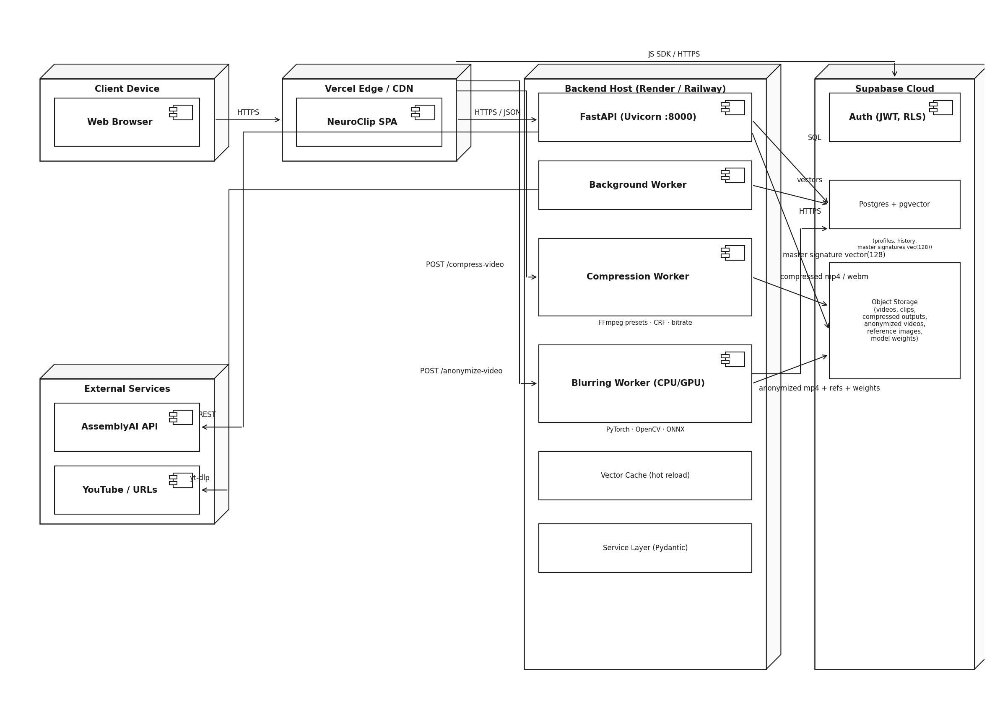

**Figure 4.9.3:** Deployment Diagram *(caption: Arial Narrow, size 10)*

Mermaid source

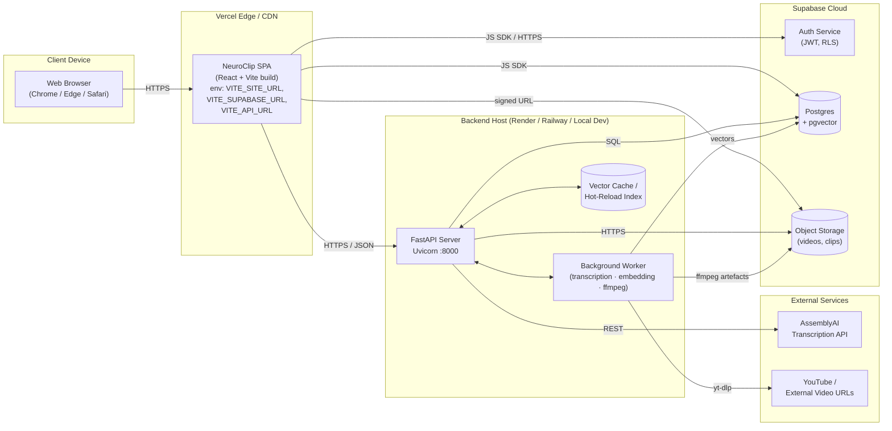
```mermaid
flowchart LR
    subgraph Client["Client Device"]
        Browser["Web Browser<br/>(Chrome / Edge / Safari)"]
    end
    subgraph Vercel["Vercel Edge / CDN"]
        SPA["NeuroClip SPA<br/>(React + Vite build)<br/>env: VITE_SITE_URL,<br/>VITE_SUPABASE_URL,<br/>VITE_API_URL"]
    end
    subgraph Backend["Backend Host (Render / Railway / Local Dev)"]
        FastAPI["FastAPI Server<br/>Uvicorn :8000"]
        Worker["Background Worker<br/>(transcription · embedding · ffmpeg)"]
        Cache[("Vector Cache /<br/>Hot-Reload Index")]
    end
    subgraph SupabaseCloud["Supabase Cloud"]
        Auth["Auth Service<br/>(JWT, RLS)"]
        PG[("Postgres<br/>+ pgvector")]
        Storage[("Object Storage<br/>(videos, clips)")]
    end
    subgraph External["External Services"]
        AAI["AssemblyAI<br/>Transcription API"]
        YT["YouTube /<br/>External Video URLs"]
    end
    Browser -- HTTPS --> SPA
    SPA -- HTTPS / JSON --> FastAPI
    SPA -- JS SDK / HTTPS --> Auth
    SPA -- JS SDK --> PG
    SPA -- signed URL --> Storage
    FastAPI <--> Worker
    FastAPI -- SQL --> PG
    FastAPI -- REST --> AAI
    FastAPI -- HTTPS --> Storage
    Worker -- yt-dlp --> YT
    Worker -- ffmpeg artefacts --> Storage
    Worker -- vectors --> PG
    FastAPI <--> Cache
```

---

### Cross-Reference Summary

| Section | Figure | Diagram | File |
|---|---|---|---|
| 4.2 | 4.2 | Use Case Diagram | `diagrams/4.2_use_case.{png,svg,mmd}` |
| 4.3.1 | — | Full-Dress Use Case (table) — Search & Assemble Clips | inline above |
| 4.4 | 4.4 | Activity Diagram | `diagrams/4.4_activity.{png,svg,mmd}` |
| 4.5 | 4.5.1 / 4.5.2 / 4.5.3 | DFD Levels 0, 1, 2 with Compression Module | `diagrams/4.5.*.{png,svg,mmd}` |
| 4.6 | 4.6 | System Sequence Diagram with Compression Flow | `diagrams/4.6_system_sequence.{png,svg,mmd}` |
| 4.7 | 4.7.1 / 4.7.2 | Sequence Diagrams (Auth + Search + Compression) | `diagrams/4.7.*.{png,svg,mmd}` |
| 4.8 | 4.8 | Design Class Diagram with Compression Classes | `diagrams/4.8_class_diagram.{png,svg,mmd}` |
| 4.9.1 | 4.9.1 | Interface Design with Compression UI Steps | `diagrams/4.9.1_interface_design.{png,svg,mmd}` |
| 4.9.2 | 4.9.2 | Component Level Design with Compression Service | `diagrams/4.9.2_component_level.{png,svg,mmd}` |
| 4.9.3 | 4.9.3 | Deployment Diagram with Compression Worker | `diagrams/4.9.3_deployment.{png,svg,mmd}` |

> **Embedding in the thesis:** Drag-drop the `.png` (or `.svg`) into Word/LaTeX and add the caption shown beneath each block (Arial Narrow, size 10). Use the `.svg` if your thesis template supports vector graphics — they remain crisp at any zoom level.
