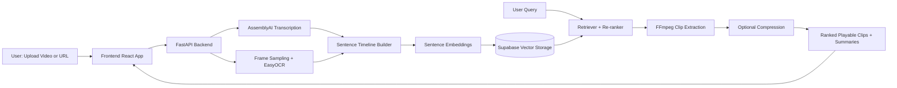

# NeuroClip Animated Architecture Workflow Guide

## Goal
Create a clean 60-90 second animated architecture explainer that shows how NeuroClip components interact from input video to output clips.

## 1. What to Show (Only Essential Blocks)
Use exactly these blocks to avoid visual clutter:
1. User Interface (React frontend)
2. Ingestion API (FastAPI)
3. Transcription (AssemblyAI)
4. Frame OCR (EasyOCR)
5. Multimodal Fusion + Embedding Model
6. Supabase Vector Storage/Search
7. Segment Retrieval + Re-ranking
8. FFmpeg Clip Extraction/Compression
9. Result Delivery (ranked playable clips)

## 2. Storyboard (Recommended Timeline)
Make one animation sequence with 7 scenes:
1. Scene 1 (0-8s): User uploads video or URL.
2. Scene 2 (8-18s): Backend ingests and triggers ASR + OCR in parallel.
3. Scene 3 (18-28s): Transcript and OCR text merge into enriched sentences.
4. Scene 4 (28-38s): Sentences convert to embeddings and persist in Supabase vectors.
5. Scene 5 (38-52s): Query enters -> retrieval + reranking highlights best segments.
6. Scene 6 (52-68s): FFmpeg extracts top clips and optional compression runs.
7. Scene 7 (68-90s): Frontend shows ranked clips, summaries, timestamps.

## 3. Visual Language (Good Research-Presentation Style)
- Canvas: 1920x1080 (16:9).
- Color set:
  - Ingestion/API: `#0B5FFF`
  - ASR/OCR: `#00A878`
  - Embeddings/Search: `#F39C12`
  - Clip output: `#E74C3C`
  - Background: `#F7F9FC`
- Typography: Use `Poppins` or `Manrope` for clean paper/demo visuals.
- Shape rule: Rounded rectangles for services, cylinders for databases, pill tags for APIs.
- Motion rule: left-to-right data flow, with pulse effect on active block.

## 4. Ready-to-Use Mermaid Base Diagram
Use this as your static blueprint before animating:

## 5. Best Tooling Options

### Option A (Fastest, no coding): Figma + Smart Animate
1. Recreate the Mermaid blocks in Figma.
2. Create one frame per scene from the storyboard.
3. Use Smart Animate between frames (300-600 ms each transition).
4. Add animated connectors (opacity + stroke-dash offset).
5. Export as MP4.

### Option B (Presentation-native): PowerPoint
1. Draw architecture blocks with consistent color coding.
2. Use Morph transition across duplicate slides.
3. Add entrance animations in this order: Input -> ASR/OCR -> Fusion -> Search -> Output.
4. Export to MP4 (1080p).

### Option C (Code-based): React + Framer Motion (highest control)
1. Build block components and connector lines in SVG.
2. Trigger step-wise animation via timeline state (`scene = 1..7`).
3. Use pulsing nodes and moving dot along edges for data packets.
4. Capture with OBS/Camtasia for a polished MP4.

## 6. Animation Parameters That Usually Look Best
- Transition duration: 0.45s
- Scene hold: 2.5-4s
- Easing: `easeInOut`
- Connector draw animation: 0.8s per edge
- Pulse scale range for active node: 1.00 -> 1.06

## 7. Voiceover Script (Short and Paper-Friendly)
"NeuroClip starts with a user video upload or URL input. The backend processes audio transcription and visual OCR in parallel, then merges both streams into enriched sentence-level units. These units are embedded into a shared semantic space and stored in Supabase for efficient retrieval. When a user submits a query, the system retrieves and reranks relevant segments, then FFmpeg generates concise clips around the best timestamps. Final outputs include ranked playable clips, timing metadata, and summaries for rapid content navigation."

## 8. Final Deliverables Checklist
- One MP4 animation (60-90 sec)
- One static PNG architecture figure for paper
- One caption (2-3 lines) aligned with methodology section

## 9. Common Mistakes to Avoid
- Too many internal nodes (keep <= 9 core blocks).
- Excessive effects (no random bounces/spins).
- Missing timestamps/flow direction labels.
- Inconsistent colors between static figure and animated video.
